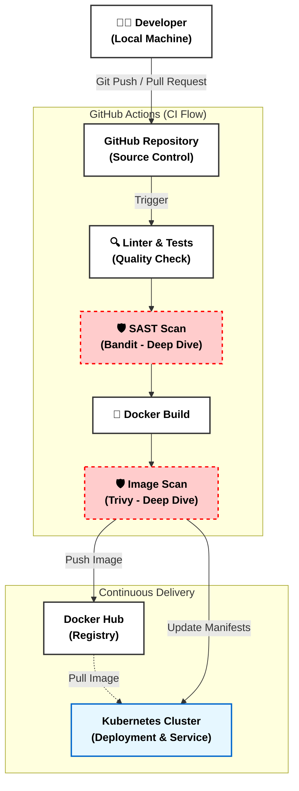

# DevOps Final Project: Automated Software Delivery Pipeline

Този проект демонстрира CI/CD процес за Python приложение, покриващ целия жизнен цикъл на софтуера - от написването на кода до деплоймънта в Kubernetes.

[CI/CD Pipeline](https://github.com/TsvetanValchinov/DevOps-final-project/actions/workflows/main.yaml)

## High-Level Solution Design

Диаграмата по-долу илюстрира автоматизирания процес, включително интегрираните проверки за сигурност.

## Покрити теми от курса (Project Scope)

Проектът реализира следните 9 DevOps практики:

* **Source Control:** Използване на Git и GitHub за управление на версиите.
* **Collaborate:** Работа чрез Feature branches и Pull Requests.
* **Branching Strategies:** Защита на main бранча и задължителен Code Review.
* **Docker:**  Използване на Docker за контейнеризация. --> Dockerfile.
* **Building Pipelines:** Автоматизиран Workflow с GitHub Actions.
* **Continuous Integration (CI):** Автоматично стартиране на Unit тестове (pytest) и Linter (flake8).
* **Security (Deep Dive):**
  * SAST (Static Application Security Testing) с Bandit.
  * Container Vulnerability Scanning с Trivy.
* **Continuous Delivery (CD):** Автоматично обновяване на Kubernetes манифестите чрез sed заместване.
* **Kubernetes:** Дефиниране на Infrastructure as Code чрез YAML манифести (Deployment & Service).

## 🛠️ Технологичен Стак

* **Language:** Python 3.9 (Flask)
* **Containerization:** Docker
* **Orchestration:** Kubernetes
* **CI/CD:** GitHub Actions
* **Security:** Bandit (Code), Trivy (Image)
* **Testing:** Pytest
